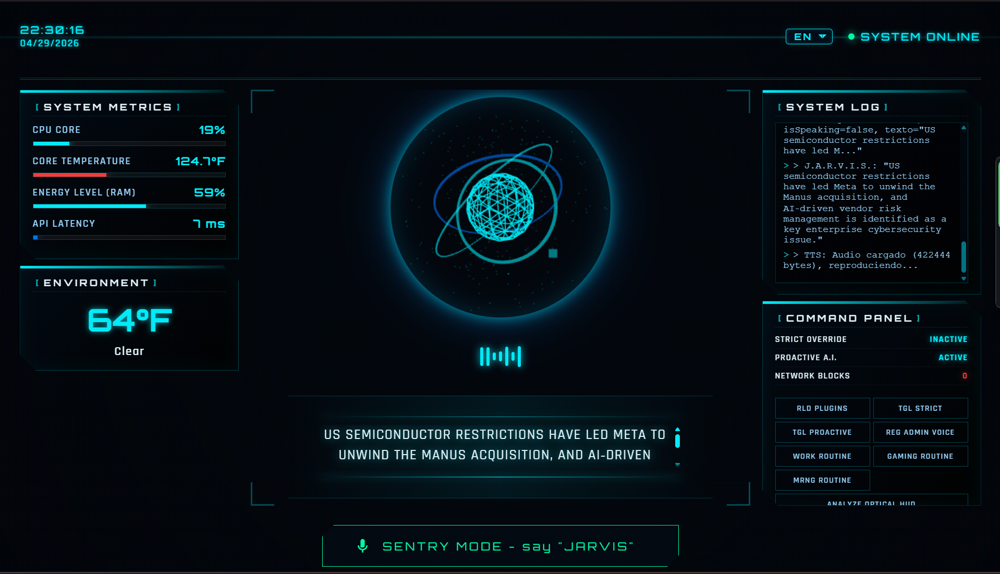

# J.A.R.V.I.S.

[](https://github.com/SrDarkoll/JARVIS/actions/workflows/ci.yml)
[](https://github.com/SrDarkoll/JARVIS/releases)
[](LICENSE)
[](#system-requirements)

**A local desktop AI assistant powered by Gemini 3.1 Flash Live for real-time full-duplex voice streaming, Spotify control, system tools, memory persistence, and guarded Windows automation.**

J.A.R.V.I.S. delivers a true conversational experience: talk naturally, interrupt anytime (*barge-in*), control your PC and Spotify with your voice in sub-second speed, and enjoy an authentic British-style AI voice (`Charon`).



---

## 🌟 Star Feature: Real-Time Full-Duplex Voice (Gemini 3.1 Flash Live)

Unlike traditional AI assistants that record, transcribe, think, and generate speech sequentially with seconds of delay, J.A.R.V.I.S. features **native bidirectional audio streaming**:

- ⚡ **Sub-Second Speech-to-Speech**: Direct bidirectional audio streaming over WebSockets (16 kHz PCM input / 24 kHz gapless PCM output) without slow intermediary text-to-speech roundtrips.
- 🛑 **Zero-Latency Barge-In Interruption**: Speak over J.A.R.V.I.S. mid-sentence and it stops immediately to listen to you, exactly like talking to a real human.
- 🛠️ **Real-Time Tool Calling (*Function Calling*)**: Ask to play music on Spotify, adjust PC volume, open applications, or check the weather, and J.A.R.V.I.S. executes the tool instantly and confirms in the exact same voice stream.
- 👑 **Authentic J.A.R.V.I.S. Voice (`Charon`)**: Sophisticated, calm, and natural voice persona that feels straight out of Iron Man.
- 🧠 **Dynamic Speaker Awareness & Memory**: Remembers who you are and recalls past conversation context seamlessly.

---

## ⚡ Quick Start (For Users)

If you just want to download and run J.A.R.V.I.S. without dealing with source code:

### 1. Download & Install (Windows)
1. Download the **`v0.1.0-alpha.4`** release package (`JARVIS-v0.1.0-alpha.4-windows.zip`) from the [Releases page](https://github.com/SrDarkoll/JARVIS/releases/tag/v0.1.0-alpha.4).
2. Extract the complete ZIP to any folder on your PC.
3. Run **`Install-JARVIS.bat`** (automatically sets up the environment and prerequisites).

### 2. Configure Your API Key
Open the generated **`.env`** file and add your free Google Gemini or Groq API key:
```env
GEMINI_API_KEY="your_gemini_api_key_here"
# or:
GROQ_API_KEY="your_groq_api_key_here"
```

### 3. Launch J.A.R.V.I.S.
Double-click **`Start-JARVIS.bat`** or run:
```powershell
python start_app.py
```
That's it! The graphical desktop HUD will open on your screen.

---

## 🎙️ What J.A.R.V.I.S. Can Do

- 🗣️ **Real-Time Full-Duplex Voice (Gemini 3.1 Flash Live)**: Talk naturally and fluidly with sub-second latency and zero-latency interruption (*barge-in*).
- 🎵 **Complete Spotify Control**: Ask to play songs (*"Play Blinding Lights by The Weeknd"*), add to queue, pause, skip, or save to liked songs (compatible with both Spotify Desktop native automation and Web API).
- 🧠 **Memory & Speaker Identification**: Remembers past conversations and facts, and recognizes who is speaking.
- 💻 **System & PC Control**: Adjust Windows master volume, launch applications and games (*"Open Steam"*, *"Launch Counter-Strike"*), check weather forecasts, and search the web.
- 🌐 **Bilingual (English & Spanish)**: Seamless speech recognition and neural voice synthesis (Piper TTS) in both languages.
- 🔒 **Safe & Auditable**: No silent arbitrary code execution; critical operations require explicit user confirmation.

---

## 🛠️ Developer & Modder Guide

For developers who want to clone the repository, customize features, or build new integrations.

### System Requirements
- **Python 3.11 or 3.12** (Python 3.13 is unsupported due to ML dependency wheels).
- **Git & Git LFS** (required to pull neural `.onnx` voice models).
- **FFmpeg** on system `PATH` (for audio conversion and voice capture).
- **eSpeak NG** on Windows (for Piper TTS phonemization).

Quick prerequisite installation on Windows:
```powershell
winget install Git.Git
winget install GitHub.GitLFS
winget install Gyan.FFmpeg
winget install eSpeak-NG.eSpeak-NG
```

### Clone & Development Setup
```powershell
# 1. Install Git LFS and clone
git lfs install
git clone https://github.com/SrDarkoll/JARVIS.git
cd JARVIS
git lfs pull

# 2. Set up virtual environment and developer dependencies
.\setup.ps1 -Dev

# (Optional) If you want full optional ML dependencies (SpeechBrain voice biometrics, RAG, Vision):
.\setup.ps1 -Dev -Full
```

On Linux or macOS:
```bash
chmod +x setup.sh
./setup.sh --dev
```

### Local Piper Voice Models
The pre-bundled `.onnx` and `.onnx.json` models are downloaded via Git LFS into the `models/` directory. You can download additional voices with:
```powershell
.\venv\Scripts\python.exe -m piper.download_voices en_US-lessac-medium --download-dir models
```

### Key Environment Variables (`.env`)

Copy `.env.example` to `.env` to configure optional features:

| Variable | Description | Default |
|---|---|---|
| `GEMINI_API_KEY` | Google AI Studio API Key (Gemini 2.5 Flash / 3.1 Live) | `""` |
| `GROQ_API_KEY` | Groq API Key (Qwen 2.5 / Llama fallback) | `""` |
| `JARVIS_GEMINI_LIVE_VOICE` | Live voice personality (`Charon`, `Puck`, `Aoede`, `Fenrir`, `Kore`) | `"Charon"` |
| `SPOTIFY_PLAYBACK_MODE` | Playback mode (`auto`, `desktop`, `api`). `SPOTIFY_PLAYBACK_MODE=desktop` controls Spotify Desktop without developer keys but does not bypass Spotify Free restrictions | `"auto"` |
| `JARVIS_VOICE_ID_ENABLED` | Enable SpeechBrain ECAPA speaker identification | `"false"` |
| `JARVIS_CORE_MODE` | Stable lightweight mode without heavy optional dependencies | `"true"` |
| `JARVIS_RUNTIME_DIR` | Local runtime directory for logs and cache | `%LOCALAPPDATA%\Jarvis` |

> [!NOTE]
> The unified diagnostic log (`log.txt`) records conversation text in plaintext locally under `JARVIS_RUNTIME_DIR` for diagnostic purposes and is never transmitted.

### Browser & Audio Recognition Support
The web HUD uses native `SpeechRecognition` in Chrome/Edge for fast client-side hints, and provides adaptive audio fallback in Firefox, Safari, and other browsers. For non-loopback network access over LAN, HTTPS is required for microphone permissions.

### Live Testing Scripts (Without Mocks)

Test integrations directly against your real running hardware and desktop applications:

```powershell
# Test Spotify Desktop live (search, playback, queueing, and controls)
python scripts\test_live_spotify.py --queue "Save Your Tears The Weeknd"
python scripts\test_live_spotify.py --controls

# Test Voice Recognition & Biometrics live
python scripts\test_live_voice_id.py --status
python scripts\test_live_voice_id.py --register "Administrator"
python scripts\test_live_voice_id.py --identify
python scripts\test_live_voice_id.py --list
```

### Automated Testing & Quality Checks

```powershell
# Run complete test suite (680+ tests)
pytest -q

# Run Ruff linter
python -m ruff check src/backend

# Verify syntax compilation
python -m compileall -q start_app.py src/backend
```

---

## 📁 Repository Architecture

```text
JARVIS/
├── src/
│   ├── backend/
│   │   ├── api/             # HTTP & WebSocket endpoints (chat, voice, status)
│   │   ├── core/            # Command pipeline, LLM planner & security boundaries
│   │   ├── modules/spotify/ # Spotify Desktop (UIA) & Web API controller
│   │   ├── services/        # Memory manager & local SQLite database
│   │   ├── tools/           # Tool catalog (volume, weather, apps, web search)
│   │   └── voice/           # Gemini Live (Full-Duplex), Piper TTS & Biometrics
│   └── frontend/            # Web HUD interface (HTML5, Vanilla CSS, JS)
├── scripts/                 # Live test scripts and release packaging
├── tests/                   # Unit & integration regression suites
├── models/                  # Local Piper neural voice models (.onnx)
└── start_app.py             # Main launcher with automatic venv detection
```

---

## 📜 License & Third-Party Notices

The J.A.R.V.I.S. source code is licensed under the [MIT License](LICENSE).

Bundled voice models (`Piper TTS`, `ECAPA-VoxCeleb`), third-party libraries, and assets retain their respective original licenses documented in [`THIRD_PARTY_NOTICES.md`](THIRD_PARTY_NOTICES.md).
